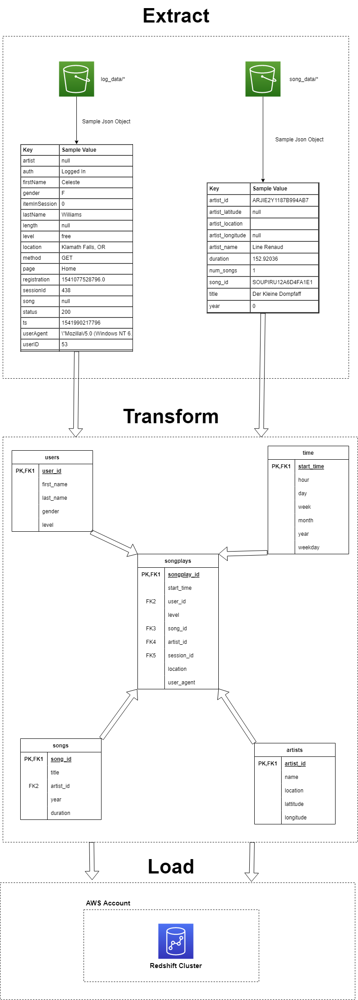

# Project: Data Warehouse

## Introduction:
this project is called sparkify,its a music project just as good as spotify. like a music enthusiast like myself,
this project contains a database of songs. currently in the format of json files.

## Project Journey

## Project description:

in this project, we will extract from two diffrently strcutred JSON Object data called (log_data, song_data),
log data will contains the logs of songs, such as name, username, id, etc..,
song_data will be about the song, song name, duration, artist, etc..,
we will pull all the data from these locations to an ETL pipline, that are hosted on S3 bucket,
will go the a Amazon Redshift to be processed on staging tables, and stored there.

## database structure:

#### Fact Table

##### songplays - records in event data associated with song plays i.e. records with page NextSong
    songplay_id, start_time, user_id, level, song_id, artist_id, session_id, location, user_agent

#### Dimension Tables

##### users - users in the app
    user_id, first_name, last_name, gender, level
##### songs - songs in music database
    song_id, title, artist_id, year, duration
##### artists - artists in music database
    artist_id, name, location, lattitude, longitude
##### time - timestamps of records in songplays broken down into specific units
    start_time, hour, day, week, month, year, weekday
    

## Project structure:
this porject contains these essinatl files to work:
1. **dwh.cfg**:
    this file will contain all the configurations for AWS such as AWS keys, cluster specs, data warehouse info, IAM info, and S3 info. 
2. **etl.py**
    this file will make all the magic happens, it will take all the queries from the file "sql_queries.py" as an input.
    will load the staging tables, and insert them to the  Amazon RDS, for more info check the docstring in "etl.py"
3. **create_tables.py**
    this file is very simple, will take "sql_queries.py" as an input, will connect to DB, drop tables if exists, and then create tables bassed on passed quries.
4. **sql_queries.py**
    this file contains all the work, it will contain the quries, from creation, copying, to insertion, the will be passed as a form of list,
    so other files could use them properly
5. **test.ipynb**
    this file is my playground, i will test all the stuff from connections, checking S3 data source, creating clusters, qureying database, and shuttung down services
    
## How to run:
1. fill the key, and secret key in "dwh.cfg"
2. run "create_tables.py"
2. run "etl.py"

